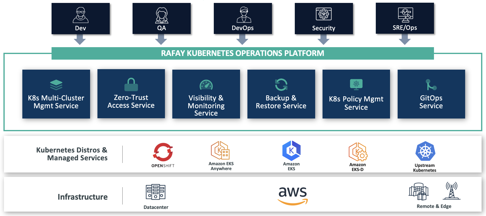
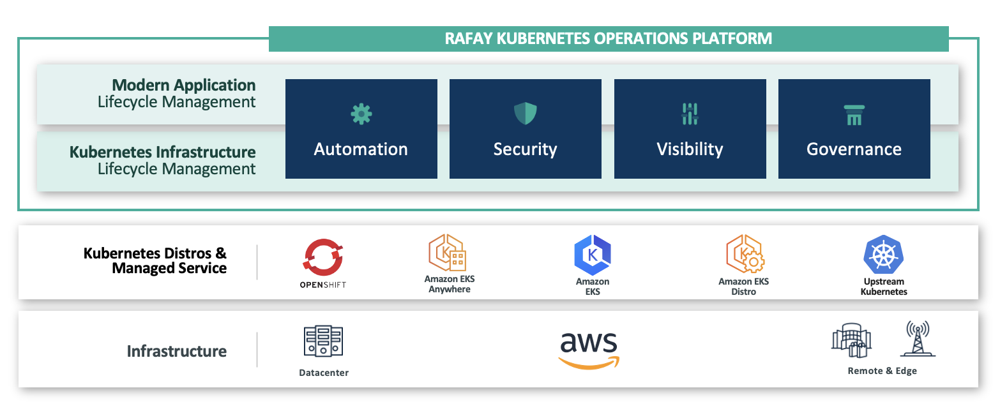

## What is Rafay?

The Rafay Kubernetes Operations Platform (KOP) is a modern operations approach for modern infrastructure enabling organizations the abilty to manage the full lifecycle of your Kubernetes infrastructure and modern applications in a single, easy to use, shared services platform.

## How does Rafay Help Make Life Easy for Platform and SRE Teams?
As Kubernetes becomes more mature through Cloud Native Computing Foundation (CNCF) projects it's becoming more complex and harder to manage at scale which is leading to increased costs, time to support, and actually inhibiting/stalling/preventing modernization efforts. Rafay combines key services that are required to run Kubernetes at scale into a single centralized platform that delivers enterprise grade Kubernetes operations. Kubernetes operations is a holistic approach that unifies the lifecycle management of both Kubernetes clusters and containerized applications. With Rafay, teams that are required to operate and/or enable other teams in an enterprise to operate Kubernetes take advantage of the following Rafay KOP services -- across both clusters and applications:

---

### Multi-Cluster Management Service: 
Manage the lifecycle of Kubernetes clusters for managed Kubernetes services, such as Amazon EKS, and self managed Kubernetes distributions.

### GitOps Service:
Enables infrastructure orchestration and application deployment through multi-stage, git-triggered pipelines.

### Zero-Trust Access Service:
Enables controlled, audited access for developers, SREs and automation systems to Kubernetes infrastructure.

### Kubernetes Policy Management Service:
Enables policy management for clusters via the Open Policy Agent (OPA) framework for Kubernetes security and governance.

### Backup & Restore Service
Enables disaster recovery and migration of the Kubernetes control plane and application data.

### Visibility & Monitoring Service
Enables development, operations and security/governance teams to visualize and monitor modern apps and underlying Kubernetes infrastructure through dedicated dashboards.

---

## Where Rafay Fits

With Rafay, enterprises can use any Kubernetes distribution and immediately gain centralized automation, security, visibility, and governance capabilities for Kubernetes cluster and application lifecycle management — across private clouds, public clouds, including AWS, and remote/edge locations.

---

Let's proceed to the workshop!
